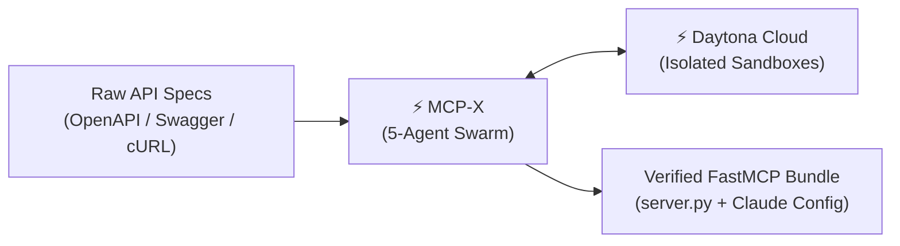
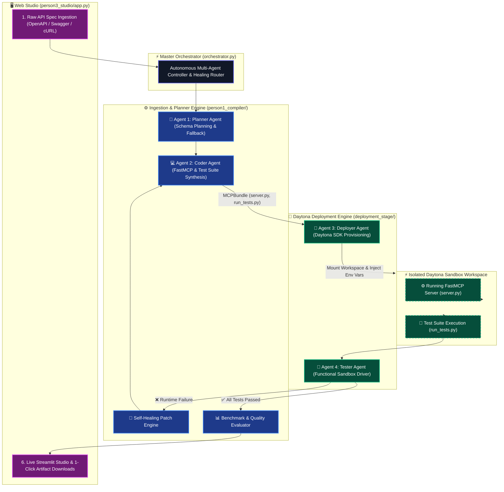
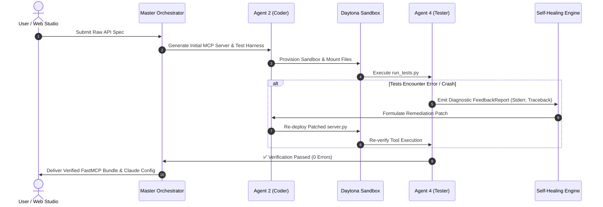

# ⚡ MCP-X
### The Autonomous, Daytona-Powered MCP & Agent Tooling Compiler

> **Built for Daytona HackSprint Singapore (August 2026)**  
> *Transforming the world's REST APIs into verified, enterprise-hardened Model Context Protocol (FastMCP) servers with zero human intervention.*

---

## 🧭 Executive Pitch Overview



---

# 🔴 Part 1: THE "WHY"
### *The Bottleneck in the AI Agent Revolution*

### 1. The MCP Era Has Arrived
The **Model Context Protocol (MCP)** pioneered by Anthropic has become the universal standard connecting LLMs and AI Agents (Claude Desktop, Cursor, Antigravity) to real-world software and enterprise data.

### 2. The Multi-Billion Dollar Friction Point
There are millions of production REST APIs across global enterprise systems. However, bridging a REST API to an enterprise-grade MCP server currently requires:
- **Painstaking Manual Engineering:** Days spent crafting parameter definitions, Pydantic type schemas, and async client plumbing.
- **Critical Security & Secret Exposure:** Hand-rolled MCP servers frequently leak API keys, authorization headers, and sensitive environment tokens directly into LLM context prompts.
- **The Execution Danger Zone:** Testing newly synthesized server code locally risks system pollution, dependency conflicts, or accidental credential exfiltration.

### 3. The Vision
**What if you could drop in any raw API specification or cURL snippet, and within seconds receive a verified, security-hardened FastMCP server that has already been deployed, tested, and self-healed inside an isolated cloud sandbox?**

---

# 🟢 Part 2: THE "WHAT"
### *Meet MCP-X: The Autonomous MCP Compiler*

**MCP-X** is an autonomous multi-agent compilation and verification platform. It automates the entire lifecycle of Model Context Protocol generation with zero human code writing required.

### 🎯 Key Product Capabilities

| Pillar | Capability | Impact |
| :--- | :--- | :--- |
| 📥 **Universal Ingestion** | Ingests OpenAPI 3.0 (JSON/YAML), Swagger 2.0, and raw cURL snippets. | Instant compatibility with 99% of web APIs out of the box. |
| 🛡️ **Enterprise Hardening** | Auto-injects token sanitization (`_sanitize_output`) and Pydantic validation. | Complete prevention of credential leaks into LLM context windows. |
| ⚡ **Daytona-Native Sandboxing** | Ephemeral, isolated Daytona Sandbox provisioning for test runs. | 100% safe code execution without polluting local environments. |
| 🔄 **Autonomous Self-Healing** | Real-time diagnostic parsing and feedback loop that auto-patches code. | Zero-touch recovery from runtime errors and signature mismatches. |
| 📦 **1-Click Client Integration** | Generates `claude_desktop_config.json` alongside `server.py`. | Ready to drop into Claude Desktop, Cursor, or Antigravity instantly. |

### 📦 The Output Artifacts (Enterprise MCP Bundle)
1. **`server.py`**: Production-ready FastMCP server implementing all endpoints as callable tools.
2. **`claude_desktop_config.json`**: Pre-configured desktop agent connection file.
3. **`test_protocol.json`**: Synthesized matrix of functional test cases.
4. **`run_tests.py`**: Autonomous test runner executed inside the Daytona sandbox.
5. **`test_report.json`**: Verified sandbox test execution scorecard with latency and status metrics.

---

# 🔵 Part 3: THE "HOW"
### *Multi-Agent Swarm Architecture & Daytona Engine*

MCP-X operates via an orchestrated 5-agent pipeline communicating across strict data contracts, with **Daytona Cloud Sandboxes** serving as the core execution and verification engine.

### 🏗️ End-to-End System Architecture



---

### ⚡ Why Daytona is the Secret Weapon

Daytona makes autonomous multi-agent code generation viable for production:
1. **Isolated Execution Guarantee:** AI-generated server scripts run in sandboxed Daytona micro-environments, eliminating risk to host machines.
2. **Ephemeral Lifecycle:** Sandboxes are spun up on-demand, mounted with code bundles and test suites, validated, and safely torn down.
3. **Environment Parity:** Daytona ensures that dependency resolution (`requirements.txt`), Python runtime versions, and environment variables are tested under real cloud conditions.

---

### 🔄 The Self-Healing Feedback Loop in Action



---

# 🚀 Live Demo & Quickstart

### 1. Quick Setup
```bash
git clone https://github.com/Nischit290402/daytona-hackathon.git
cd daytona-hackathon

# Create & activate environment
python -m venv daytona
.\daytona\Scripts\activate      # Windows
source daytona/bin/activate     # Linux / macOS

# Install dependencies
pip install -r requirements.txt
```

### 2. Launch the Web Studio
```bash
streamlit run person3_studio/app.py
```
Open **[http://localhost:8501](http://localhost:8501)** in your browser:
1. Select the **GitHub Issues & Repositories API (Showcase)** preset.
2. Click **🚀 Compile, Deploy & Verify in Daytona**.
3. Watch the live multi-agent pipeline stream in real time.
4. Download the verified **`server.py`** and **`claude_desktop_config.json`**.

### 3. Run via CLI Orchestrator
```bash
python orchestrator.py
```

---

## 👥 Team & Architecture Separation

- **👤 Person 1 (Compiler & Self-Healing Core):** Multi-Spec Ingestion, Planner Agent (Agent 1), Coder Agent (Agent 2), Self-Healing Patch Loop, Benchmark Evaluator (`person1_compiler/`).
- **👤 Person 2 (Daytona Cloud Runtime):** Daytona Deployer Agent (Agent 3), Daytona Tester Agent (Agent 4), Sandbox Workspace Manager (`deployment_stage/`).
- **👤 Person 3 (Web Studio UI):** Streamlit Web Studio, Showcase Presets, Live Multi-Agent Event Streamer (`person3_studio/`).
- **🔄 Master Orchestrator:** End-to-end pipeline coordination and feedback routing (`orchestrator.py`).
